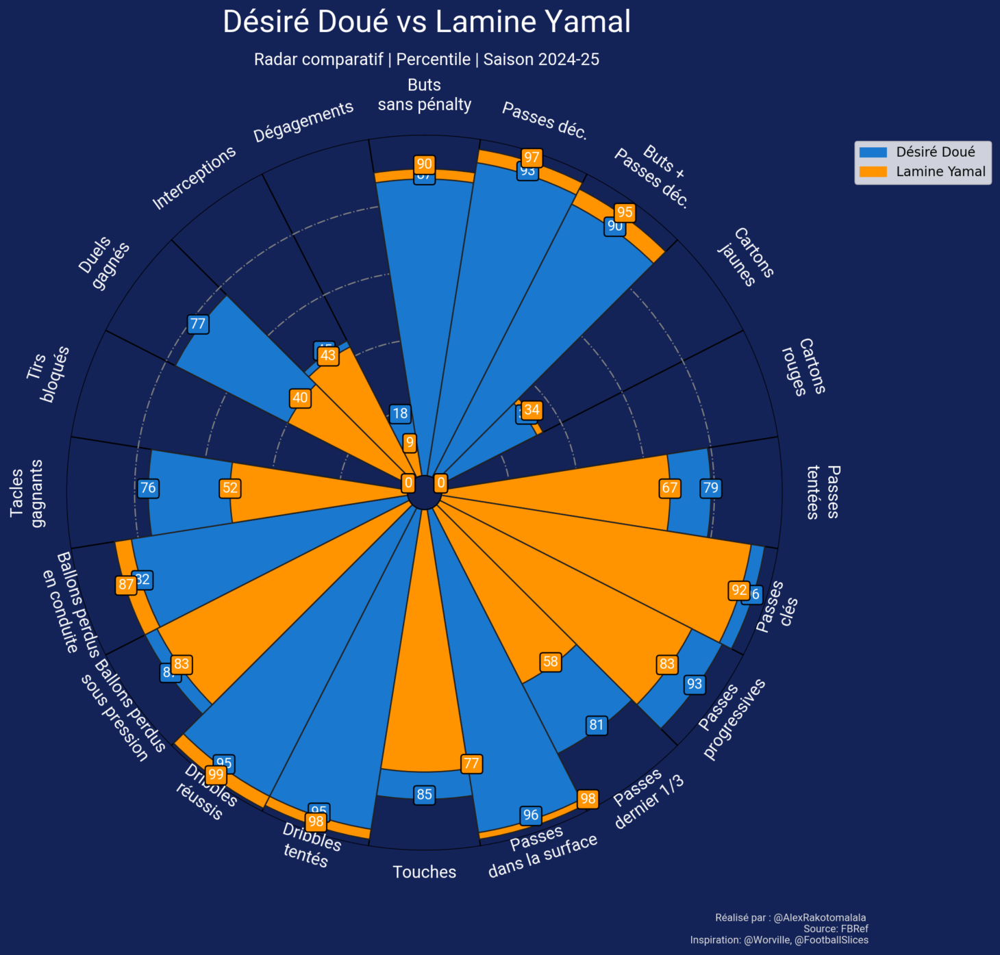

# 📊 Radar de performances - Saison 2024/25

Une application **Streamlit** interactive pour visualiser les performances statistiques de joueurs de football via des radars, en mode **individuel** ou **comparatif**. Les statistiques sont normalisées par 90 minutes de jeu et au format Percentile pour permettre des comparaisons équitables.

---

## 🚀 Fonctionnalités

- 🎯 **Radar individuel** : percentile de chaque statistique par rapport à la ligue du joueur.
- ⚔️ **Radar comparatif** : confrontation visuelle entre deux joueurs issus de ligues différentes.
- 🕵️‍♂️ **Scraping intégré** : récupération automatisée des données via FBRef.

---

## 🖥️ Aperçu

> Une visualisation claire et esthétique inspirée des travaux de @Worville et @FootballSlices.



---


---

## 🔧 Installation

1. **Cloner le dépôt :**

```bash
git clone https://https://github.com/Rako75/ComparePlayers.git
